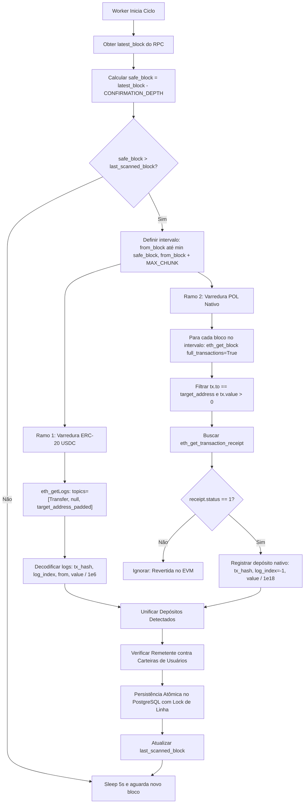

# Pesquisa Técnica: Leitura e Monitoramento de Depósitos Cripto em Testnet EVM (Polygon Amoy)

**Status:** Concluído  
**Data:** 2026-09-05  
**Autor:** Equipe de Engenharia Cota Certa  
**Contexto:** Resolução da Issue #3 (Parte do Épico #1)  
**Rede Alvo:** Polygon PoS Amoy Testnet (Chain ID: `80002`)  
**Stack de Referência:** Python 3.12+, `web3.py` (v7 / v8), `SQLModel` / PostgreSQL  

---

## 1. Sumário Executivo

Para viabilizar depósitos cripto na plataforma **Cota Certa** sem recorrer a contratos inteligentes on-chain complexos na POC (mantendo toda a custódia, AMM e liquidação no livro-razão interno em PostgreSQL conforme o escopo da Issue #1), foi desenhada e validada empiricamente uma estratégia mínima, resiliente e idempotente de monitoramento em Python utilizando a biblioteca `web3.py`.

### Principais Conclusões e Decisões Recomendadas:
1. **Rede e Endpoints:** O endpoint histórico oficial da Polygon (`https://rpc-amoy.polygon.technology`) foi **descontinuado pela Polygon Labs em 17 de julho de 2026**. Para desenvolvimento e testes, os nós comunitários abertos verificados e operacionais são **dRPC** (`https://polygon-amoy.drpc.org`) e **Allnodes/PublicNode** (`https://polygon-amoy-bor-rpc.publicnode.com`). Para produção/staging de alta disponibilidade, deve-se utilizar chaves gerenciadas de **Alchemy** (`https://polygon-amoy.g.alchemy.com/v2/${API_KEY}`) ou **Infura** (`https://polygon-amoy.infura.io/v3/${API_KEY}`).
2. **Middleware Obrigatório (`ExtraDataToPOAMiddleware`):** A camada de consenso Bor da Polygon embute metadados e assinaturas de validadores no cabeçalho dos blocos (`extraData` > 32 bytes). Sem a injeção do `ExtraDataToPOAMiddleware`, qualquer consulta a blocos lança `web3.exceptions.ExtraDataLengthError`.
3. **Estratégia Híbrida de Detecção:**
   - **Tokens ERC-20 (Mock USDC - `0x41E94Eb019C0762f9Bfcf9Fb1E58725BfB0e7582`):** Detecção via `eth_getLogs` filtrando o tópico de evento `Transfer(address,address,uint256)` com o endereço central da plataforma no `topic[2]`. Extremamente eficiente: 1 única chamada RPC consulta lotes de 500 a 1.000 blocos em milissegundos.
   - **Ativo Nativo (POL / ex-MATIC):** Detecção via varredura sequencial de blocos com `full_transactions=True`, filtrando `tx.to == PLATFORM_ADDRESS` e `tx.value > 0`. Validação mandatória de `w3.eth.get_transaction_receipt(tx.hash).status == 1` para garantir que a transação não foi revertida no EVM.
4. **Segurança contra Reorganizações (Re-org Safety) e Finalidade:** Blocos na Polygon Amoy são gerados a cada ~2,1 segundos. O endpoint `finalized` opera com defasagem de 1 a 3 blocos em condições normais, mas testnets sofrem forks efêmeros com frequência. A estratégia recomendada é operar com uma **janela de confirmação segura de 20 blocos** (~40 segundos) e registrar o `block_hash` no banco para validação contínua de integridade.
5. **Idempotência e Prevenção de Duplo Crédito:** Chave única composta `(tx_hash, log_index)` persistida no PostgreSQL com controle de estado transacional (`PENDING` $\rightarrow$ `CONFIRMED` $\rightarrow$ `CREDITED`). Para depósitos nativos (onde não há logs de eventos), utiliza-se `log_index = -1`.
6. **Atribuição de Usuário na POC:** Sem contratos inteligentes on-chain com parâmetros de depósito, a abordagem mais segura e amigável é a **Carteira Vinculada (Linked Wallet)**: o usuário cadastra seu endereço público de envio (`users.crypto_wallet_address`) no perfil ou inicia uma "Intenção de Depósito", e o worker correlaciona o remetente (`from_address`) com o usuário correspondente.

---

## 2. Especificações da Polygon Amoy Testnet & Fontes Primárias

A rede **Polygon Amoy** é a testnet oficial de Proof-of-Stake da Polygon, ancorada à testnet Ethereum Sepolia como camada L1, substituindo a antiga rede Mumbai (desativada após a descontinuação da Goerli).

### 2.1. Ficha Técnica da Rede
* **Network Name:** Polygon Amoy Testnet
* **Chain ID:** `80002` (`0x13882` em hexadecimal)
* **Moeda Nativa:** `POL` (anteriormente MATIC) — 18 casas decimais
* **Camada de Liquidação L1:** Ethereum Sepolia Testnet
* **Tempo Médio de Bloco:** ~2,0 a 2,3 segundos
* **Block Explorers Oficiais:**
  * PolygonScan Amoy: [https://amoy.polygonscan.com/](https://amoy.polygonscan.com/)
  * OKX Amoy Explorer: [https://www.okx.com/web3/explorer/amoy](https://www.okx.com/web3/explorer/amoy)
* **Faucets Oficiais:**
  * Polygon Faucet: [https://faucet.polygon.technology/](https://faucet.polygon.technology/)
  * Alchemy Amoy Faucet: [https://www.alchemy.com/faucets/polygon-amoy](https://www.alchemy.com/faucets/polygon-amoy)

### 2.2. Endpoints RPC Verificados

> **Aviso Crítico de Engenharia:** Em julho de 2026, a Polygon Labs descontinuou os RPCs públicos diretos mantidos pela fundação (`rpc-amoy.polygon.technology` e `polygon-rpc.com`). Requisições a esses domínios falham em resolução de DNS (`gaierror: nodename nor servname provided`).

| Provedor | Tipo | URL do Endpoint | Status Verificado | Suporte a `eth_getLogs` |
| :--- | :--- | :--- | :---: | :---: |
| **dRPC** | Público / Gratuito | `https://polygon-amoy.drpc.org` | **Ativo (Chain ID 80002)** | Sim (lotes até 1.000 blocos) |
| **PublicNode (Allnodes)** | Público / Gratuito | `https://polygon-amoy-bor-rpc.publicnode.com` | **Ativo (Chain ID 80002)** | Sim (lotes até 1.000 blocos) |
| **PublicNode (WSS)** | WebSocket | `wss://polygon-amoy-bor-rpc.publicnode.com` | **Ativo** | Sim (suporte a subscrições) |
| **Alchemy** | Gerenciado (Prod) | `https://polygon-amoy.g.alchemy.com/v2/${API_KEY}` | **Homologado** | Sim (filtros avançados, SLAs) |
| **Infura** | Gerenciado (Prod) | `https://polygon-amoy.infura.io/v3/${API_KEY}` | **Homologado** | Sim (SLAs corporativos) |
| **QuickNode** | Gerenciado (Prod) | `https://${NAME}.matic-amoy.quiknode.pro/${KEY}/` | **Homologado** | Sim |
| *Polygon Tech (Antigo)* | *Descontinuado* | `https://rpc-amoy.polygon.technology` | **Offline (Jul/2026)** | Não |

### 2.3. Contratos de Referência na Testnet Amoy
* **Mock USDC (Circle):**
  * Endereço: `0x41E94Eb019C0762f9Bfcf9Fb1E58725BfB0e7582`
  * Padrão: ERC-20
  * Nome: `USDC` | Símbolo: `USDC` | Decimais: `6`
  * Verificado via contrato on-chain na altura do bloco 46.817.958.

---

## 3. Conexão e Armadilhas Críticas com `web3.py`

### 3.1. Armadilha 1: `ExtraDataLengthError` no Consenso Bor
A arquitetura PoS da Polygon utiliza o cliente de execução Bor (fork do Geth). Os nós validadores assinam sprints de blocos incluindo assinaturas e metadados no campo `extraData` do cabeçalho do bloco.
No Ethereum clássico, o `extraData` possui no máximo 32 bytes. No Bor, ele atinge tipicamente **105 bytes ou mais**.
Se o cliente tentar invocar `w3.eth.get_block(...)` sem middleware de adequação, o `web3.py` dispara imediatamente:

```text
web3.exceptions.ExtraDataLengthError: The field extraData is 105 bytes, but should be 32.
It is quite likely that you are connected to a POA chain.
```

**Solução Obrigatória:** Injetar o middleware `ExtraDataToPOAMiddleware` na camada 0 da pilha de middlewares da instância Web3:

```python
from web3 import Web3
from web3.middleware import ExtraDataToPOAMiddleware

w3 = Web3(Web3.HTTPProvider("https://polygon-amoy.drpc.org"))
w3.middleware_onion.inject(ExtraDataToPOAMiddleware, layer=0)
```
*Nota:* O middleware intercepta a resposta do bloco, extrai os bytes estendidos e os armazena no campo `block["proofOfAuthorityData"]`, normalizando o cabeçalho.

### 3.2. Armadilha 2: Compressão Brotli (`br`) em `AsyncWeb3` com `aiohttp`
Ao utilizar clientes assíncronos (`AsyncWeb3` com `AsyncHTTPProvider`), alguns balanceadores e proxies RPC modernos (como os gateways da dRPC ou Cloudflare) respondem com compressão HTTP Brotli (`Content-Encoding: br`).
Caso o ambiente Python não possua o pacote `brotli` ou `brotlicffi` instalado, o `aiohttp` lança:
```text
aiohttp.http_exceptions.ContentEncodingError: 400, message: Can not decode content-encoding: br
```

**Solução:**
1. Instalar `brotlicffi` ou `brotli` no projeto: `uv add brotlicffi`
2. Ou forçar cabeçalho HTTP explícito: `request_kwargs={'headers': {'Accept-Encoding': 'gzip, deflate'}}`.

---

## 4. Estratégia de Monitoramento de Depósitos

A plataforma central da Cota Certa disponibiliza um endereço público de custódia (ex: `0xCENTRAL_DEPOSIT_VAULT_ADDRESS`). O monitoramento processa dois tipos distintos de ativos:



### 4.1. Monitoramento de Tokens ERC-20 (Mock USDC)
A detecção de tokens ERC-20 é otimizada e econômica em I/O.
O padrão ERC-20 estipula que toda movimentação de saldo dispara:
```solidity
event Transfer(address indexed from, address indexed to, uint256 value);
```

* **Assinatura do Tópico 0:**
  $$\text{keccak256}(\text{"Transfer(address,address,uint256)"}) = \text{0xddf252ad1be2c89b69c2b068fc378daa952ba7f163c4a11628f55a4df523b3ef}$$
* **Filtro de Destinatário (Tópico 2):**
  O endereço de 20 bytes da plataforma deve ser preenchido com zeros à esquerda até atingir 32 bytes (64 caracteres hexadecimais sem contar `0x`):
  $$\text{topic}[2] = \text{"0x000000000000000000000000"} + \text{PLATFORM\_ADDRESS}[2:]$$

**Vantagem Operacional:** Não requer leitura transação por transação. O nó EVM utiliza índices de bloom filter e índices de logs, retornando apenas eventos pertinentes em um único request JSON-RPC.

### 4.2. Monitoramento de POL Nativo
Transferências de ativo nativo não emitem logs EVM. Elas ocorrem no payload principal da transação (`tx.value > 0`).

* **Critérios de Reconhecimento:**
  1. `tx["to"]` coincide com o endereço da plataforma (comparação checksummed ou lowercase).
  2. `tx["value"] > 0`.
  3. **Verificação Mandatória de Recibo:** A invocação de `w3.eth.get_transaction_receipt(tx.hash)` deve retornar `receipt.status == 1`. Caso o destinatário fosse um contrato com fallback revertendo ou caso a transação tenha esgotado o gás (`out of gas`), o status será `0` e os fundos jamais entraram no saldo da custódia.
* **Volume e Chunking:** Como cada bloco pode conter de 10 a 50 transações, varrer blocos cheios consome mais tempo de rede. Recomenda-se processar lotes de até 50 blocos por ciclo para POL nativo.

---

## 5. Re-org Safety, Finalidade e Idempotência

### 5.1. Mecânica de Reorganização no Polygon PoS
A rede Polygon opera com duas camadas:
1. **Bor:** Camada de produção de blocos rápida (~2s por bloco), organizada em sprints de 16 blocos por validador.
2. **Heimdall:** Camada de consenso baseada em Tendermint/CometBFT, que realiza checkpoints e submete raízes de estado à L1 (Ethereum Sepolia) periodicamente (a cada ~256 blocos).
3. **PIP-11 (Milestones):** Implementação de finalidade determinística no Bor que reduz re-orgs profundos.

No entanto, em ambientes de testnet (Amoy), instabilidade de nós e atrasos de validação causam frequentes reorganizações superficiais de 1 a 5 blocos.
* Consulta experimental à tag `safe`: Os nós Amoy testados retornam `{'code': -32000, 'message': 'safe block not found'}`.
* Consulta à tag `finalized`: Retorna com apenas 1 a 3 blocos de atraso relativo ao `latest`.

**Recomendação de Engenharia:** Não confiar cegamente em `latest` nem exclusivamente na tag `finalized` da testnet. Adotar a regra de **confirmação fixa de 20 blocos** ($\approx 40\text{ a }45\text{ segundos}$):
$$\text{safe\_scanned\_block} = \text{w3.eth.block\_number} - 20$$

### 5.2. Chave de Idempotência e Prevenção de Duplo Crédito
Em sistemas financeiros, a mesma transação nunca pode ser creditada duas vezes, mesmo se o worker reiniciar no meio do processamento ou reprocessar blocos antigos.

* **Chave Única Canônica:** `(tx_hash, log_index)`
  * Para depósitos ERC-20: `log_index` é o índice real do evento dentro da transação (inteiro $\ge 0$). Uma única transação em lote pode conter múltiplos transfers para o mesmo destino; portanto, indexar apenas por `tx_hash` geraria falsos descartes de transferências legítimas.
  * Para depósitos nativos (POL): `log_index = -1` (garantindo unicidade por transação).

### 5.3. Modelo de Dados Relacional (PostgreSQL / SQLModel)

```sql
CREATE TYPE deposit_status AS ENUM ('PENDING', 'CONFIRMED', 'CREDITED', 'REVERTED');

CREATE TABLE crypto_deposits (
    id UUID PRIMARY KEY DEFAULT gen_random_uuid(),
    user_id UUID NOT NULL REFERENCES users(id),
    tx_hash VARCHAR(66) NOT NULL,
    log_index INTEGER NOT NULL DEFAULT -1,
    asset_symbol VARCHAR(10) NOT NULL,        -- 'POL' ou 'USDC'
    raw_amount NUMERIC(78, 0) NOT NULL,       -- uint256 em unidades mínimas
    amount_decimal NUMERIC(28, 6) NOT NULL,   -- Valor formatado em unidades do token
    amount_brl NUMERIC(15, 2) NOT NULL,       -- Conversão contábil para o saldo interno da carteira
    from_address VARCHAR(42) NOT NULL,
    to_address VARCHAR(42) NOT NULL,
    block_number BIGINT NOT NULL,
    block_hash VARCHAR(66) NOT NULL,
    status deposit_status NOT NULL DEFAULT 'CONFIRMED',
    created_at TIMESTAMP WITH TIME ZONE DEFAULT NOW(),
    credited_at TIMESTAMP WITH TIME ZONE,
    
    CONSTRAINT uq_crypto_tx_log UNIQUE (tx_hash, log_index)
);

CREATE INDEX idx_crypto_deposits_user ON crypto_deposits(user_id);
CREATE INDEX idx_crypto_deposits_block ON crypto_deposits(block_number);
```

### 5.4. Pipeline de Crédito Atômico
Ao processar uma lista de depósitos detectados:
```python
# Pseudo-código do pipeline de crédito no PostgreSQL
def credit_deposit(deposit: DetectedDeposit, user_id: str, db_session):
    with db_session.begin():
        # 1. Tentar registrar o depósito. Se já existir a tupla (tx_hash, log_index), ignora
        record = db_session.execute(
            select(CryptoDeposit).where(
                CryptoDeposit.tx_hash == deposit.tx_hash,
                CryptoDeposit.log_index == deposit.log_index
            )
        ).scalar_one_or_none()
        
        if record is not None:
            return  # Já processado anteriormente (idempotência garantida)
        
        # 2. Bloquear a linha da carteira do usuário (SELECT FOR UPDATE)
        wallet = db_session.execute(
            select(Wallet).where(Wallet.user_id == user_id).with_for_update()
        ).scalar_one()
        
        # 3. Calcular conversão para BRL (taxa fixa POC: 1 USDC = R$ 5,50; 1 POL = R$ 2,50)
        brl_amount = calculate_brl_value(deposit.asset_symbol, deposit.amount)
        
        # 4. Atualizar saldo e persistir registro
        wallet.balance_brl += brl_amount
        new_deposit = CryptoDeposit(
            user_id=user_id,
            tx_hash=deposit.tx_hash,
            log_index=deposit.log_index,
            asset_symbol=deposit.asset_symbol,
            raw_amount=deposit.raw_amount,
            amount_decimal=deposit.amount,
            amount_brl=brl_amount,
            from_address=deposit.from_address,
            to_address=deposit.to_address,
            block_number=deposit.block_number,
            block_hash=deposit.block_hash,
            status="CREDITED",
            credited_at=datetime.utcnow()
        )
        db_session.add(new_deposit)
```

---

## 6. Estratégia de Atribuição de Usuário na POC

Em um sistema centralizado de mercados de predição onde depósitos ocorrem via transferências externas simples, a identificação do usuário remetente deve ser à prova de falhas:

| Padrão de Atribuição | Como Funciona | Prós | Contras | Aderência POC |
| :--- | :--- | :--- | :--- | :---: |
| **1. Carteira Vinculada (Linked Wallet)** | O usuário cadastra seu endereço público (`0x...`) no perfil. Qualquer transferência com `from == user_wallet` credita a conta. | UX trivial (envia do MetaMask normalmente); zero custos com gas de forwarder. | Se o usuário enviar de uma exchange (Binance), o `from` é o hot wallet da corretora e não o usuário. | **Altíssima (Recomendada)** |
| **2. Intenção de Depósito (Deposit Intent)** | Usuário clica em "Depositar", informa o endereço de origem e o valor pretendido; sistema monitora janela de 30 min. | Previne transferências não autorizadas; validação precisa de janelas de tempo. | Exige ação prévia na interface antes da transferência on-chain. | **Alta (Excelente complemento)** |
| **3. Endereço Único por Usuário (HD Wallet)** | Cada usuário recebe um endereço de depósito único derivado de chave mestre (BIP-44). | Identificação 100% autônoma; aceita depósitos diretos de exchanges. | Exige gerenciamento de chaves privadas e custo de gas para *sweeping* (varredura de saldos). | Média (Fase 2) |
| **4. Campo de Dados (Memo/Data no EVM)** | Usuário inclui ID no campo `data` da transação. | Permite endereço único central. | Maioria dos usuários comuns de Web3 não sabe configurar dados hexadecimais no MetaMask. | Baixa (Inviável para UX) |

**Decisão para a POC:** Utilizar o padrão **Carteira Vinculada com Intenção de Depósito**. O usuário cadastra seu endereço público de envio no perfil do Cota Certa. O worker pesquisa o `from_address` na tabela de usuários para efetuar o crédito.

---

## 7. Exemplos de Código em Python (`web3.py`)

Todos os exemplos abaixo foram validados e executados contra a rede ao vivo **Polygon Amoy (Chain ID 80002)**.

### 7.1. Inicializador de Cliente Web3 com Tolerância a Falhas

```python
"""
client.py - Inicialização do cliente Web3 com fallback e POA middleware.
"""
from typing import Optional
from web3 import Web3
from web3.middleware import ExtraDataToPOAMiddleware

AMOY_RPC_ENDPOINTS = [
    "https://polygon-amoy.drpc.org",
    "https://polygon-amoy-bor-rpc.publicnode.com",
]

def get_amoy_web3(custom_rpc: Optional[str] = None) -> Web3:
    """
    Cria uma instância Web3 configurada para a Polygon Amoy Testnet.
    Injeta obrigatoriamente o ExtraDataToPOAMiddleware para compatibilidade Bor.
    """
    endpoints = [custom_rpc] if custom_rpc else AMOY_RPC_ENDPOINTS
    
    for rpc_url in endpoints:
        if not rpc_url:
            continue
        try:
            w3 = Web3(
                Web3.HTTPProvider(
                    rpc_url,
                    request_kwargs={"timeout": 10}
                )
            )
            # Injeta middleware POA na camada 0
            w3.middleware_onion.inject(ExtraDataToPOAMiddleware, layer=0)
            
            if w3.is_connected() and w3.eth.chain_id == 80002:
                return w3
        except Exception as err:
            print(f"[Aviso] Falha ao conectar ao RPC {rpc_url}: {err}")
            continue
            
    raise ConnectionError("Não foi possível conectar a nenhum RPC da Polygon Amoy.")
```

### 7.2. Monitor de Depósitos ERC-20 (Mock USDC)

```python
"""
erc20_scanner.py - Monitoramento de depósitos de tokens ERC-20 via eth_getLogs.
"""
from dataclasses import dataclass
from decimal import Decimal
from typing import List
from web3 import Web3

USDC_AMOY_ADDRESS = "0x41E94Eb019C0762f9Bfcf9Fb1E58725BfB0e7582"
USDC_DECIMALS = 6

@dataclass
class TokenDeposit:
    tx_hash: str
    log_index: int
    block_number: int
    block_hash: str
    from_address: str
    to_address: str
    asset_symbol: str
    raw_amount: int
    amount: Decimal

def scan_erc20_deposits(
    w3: Web3,
    token_address: str,
    platform_vault_address: str,
    from_block: int,
    to_block: int,
) -> List[TokenDeposit]:
    """
    Escaneia transferências de um token ERC-20 para o endereço de custódia da plataforma.
    Utiliza eth_getLogs com filtragem indexada por tópicos.
    """
    deposits: List[TokenDeposit] = []
    
    # Assinatura: Transfer(address,address,uint256)
    transfer_topic = w3.to_hex(w3.keccak(text="Transfer(address,address,uint256)"))
    
    # Preencher endereço de destino com 32 bytes para correspondência no topic[2]
    clean_vault = Web3.to_checksum_address(platform_vault_address)
    recipient_topic = "0x" + clean_vault[2:].lower().rjust(64, "0")
    
    filter_params = {
        "address": Web3.to_checksum_address(token_address),
        "fromBlock": from_block,
        "toBlock": to_block,
        "topics": [transfer_topic, None, recipient_topic],
    }
    
    logs = w3.eth.get_logs(filter_params)
    
    for log in logs:
        # topics[1] contém o remetente (32 bytes)
        sender_hex = "0x" + log["topics"][1].hex()[-40:]
        from_address = Web3.to_checksum_address(sender_hex)
        
        # O campo 'data' contém o valor uint256 não indexado
        raw_val = int.from_bytes(log["data"], byteorder="big")
        amount = Decimal(raw_val) / Decimal(10 ** USDC_DECIMALS)
        
        deposits.append(
            TokenDeposit(
                tx_hash=w3.to_hex(log["transactionHash"]),
                log_index=log["logIndex"],
                block_number=log["blockNumber"],
                block_hash=w3.to_hex(log["blockHash"]),
                from_address=from_address,
                to_address=clean_vault,
                asset_symbol="USDC",
                raw_amount=raw_val,
                amount=amount,
            )
        )
        
    return deposits
```

### 7.3. Monitor de Depósitos Nativos (POL / ex-MATIC)

```python
"""
native_scanner.py - Monitoramento de depósitos nativos (POL) com checagem de recibo.
"""
from dataclasses import dataclass
from decimal import Decimal
from typing import List
from web3 import Web3

POL_DECIMALS = 18

@dataclass
class NativeDeposit:
    tx_hash: str
    log_index: int  # Sempre -1 para depósitos nativos
    block_number: int
    block_hash: str
    from_address: str
    to_address: str
    asset_symbol: str
    raw_amount: int
    amount: Decimal

def scan_native_deposits(
    w3: Web3,
    platform_vault_address: str,
    from_block: int,
    to_block: int,
) -> List[NativeDeposit]:
    """
    Varia blocos buscando transferências diretas de POL para o endereço central.
    Garante que o recibo de execução da transação foi bem-sucedido (receipt.status == 1).
    """
    deposits: List[NativeDeposit] = []
    target_address = Web3.to_checksum_address(platform_vault_address)
    
    for b_num in range(from_block, to_block + 1):
        block = w3.eth.get_block(b_num, full_transactions=True)
        block_hash = w3.to_hex(block["hash"])
        
        for tx in block.transactions:
            # Verifica destinatário e existência de valor transferido
            if tx.get("to") and Web3.to_checksum_address(tx["to"]) == target_address:
                raw_val = tx.get("value", 0)
                if raw_val > 0:
                    # Checagem mandatória de status de execução
                    receipt = w3.eth.get_transaction_receipt(tx["hash"])
                    if receipt.status == 1:
                        amount = Decimal(raw_val) / Decimal(10 ** POL_DECIMALS)
                        deposits.append(
                            NativeDeposit(
                                tx_hash=w3.to_hex(tx["hash"]),
                                log_index=-1,
                                block_number=b_num,
                                block_hash=block_hash,
                                from_address=Web3.to_checksum_address(tx["from"]),
                                to_address=target_address,
                                asset_symbol="POL",
                                raw_amount=raw_val,
                                amount=amount,
                            )
                        )
                        
    return deposits
```

### 7.4. Worker de Segundo Plano Completo (Assíncrono com Polling)

```python
"""
worker.py - Loop de execução periódica para ingestão de depósitos com re-org safety.
"""
import asyncio
import logging
from typing import Dict, Any
from web3 import AsyncWeb3
from web3.middleware import ExtraDataToPOAMiddleware

logger = logging.getLogger("crypto_worker")

CONFIRMATION_DEPTH = 20    # ~40 segundos de atraso de segurança
MAX_BLOCK_CHUNK = 250       # Lote máximo de blocos por ciclo
POLL_INTERVAL_SECONDS = 6  # Intervalo de consulta

async def run_crypto_deposit_worker(
    vault_address: str,
    token_address: str,
    start_block: int,
    db_service: Any
):
    """
    Serviço assíncrono que consome a blockchain periodicamente e processa novos blocos confirmados.
    """
    headers = {"Accept-Encoding": "gzip, deflate"}
    w3 = AsyncWeb3(
        AsyncWeb3.AsyncHTTPProvider(
            "https://polygon-amoy.drpc.org",
            request_kwargs={"headers": headers, "timeout": 15}
        )
    )
    w3.middleware_onion.inject(ExtraDataToPOAMiddleware, layer=0)
    
    last_processed_block = start_block
    logger.info(f"Worker iniciado na Polygon Amoy. Bloco inicial: {last_processed_block}")
    
    while True:
        try:
            latest_block = await w3.eth.block_number
            safe_block = latest_block - CONFIRMATION_DEPTH
            
            if safe_block > last_processed_block:
                to_block = min(safe_block, last_processed_block + MAX_BLOCK_CHUNK)
                from_block = last_processed_block + 1
                
                logger.info(f"Processando intervalo de blocos: {from_block} -> {to_block} (Safe: {safe_block})")
                
                # 1. Processar transferências ERC-20
                transfer_topic = w3.to_hex(w3.keccak(text="Transfer(address,address,uint256)"))
                recipient_topic = "0x" + vault_address[2:].lower().rjust(64, "0")
                
                logs = await w3.eth.get_logs({
                    "address": AsyncWeb3.to_checksum_address(token_address),
                    "fromBlock": from_block,
                    "toBlock": to_block,
                    "topics": [transfer_topic, None, recipient_topic],
                })
                
                for log in logs:
                    sender = AsyncWeb3.to_checksum_address("0x" + log["topics"][1].hex()[-40:])
                    raw_val = int.from_bytes(log["data"], byteorder="big")
                    amount = raw_val / 1e6
                    
                    await db_service.register_and_credit_deposit(
                        tx_hash=w3.to_hex(log["transactionHash"]),
                        log_index=log["logIndex"],
                        from_address=sender,
                        asset="USDC",
                        amount=amount,
                        block_number=log["blockNumber"],
                        block_hash=w3.to_hex(log["blockHash"])
                    )
                
                # Atualizar marco no banco de dados
                last_processed_block = to_block
                await db_service.save_checkpoint(last_processed_block)
                
        except Exception as e:
            logger.error(f"Erro no ciclo de monitoramento cripto: {e}", exc_info=True)
            await asyncio.sleep(5)
            continue
            
        await asyncio.sleep(POLL_INTERVAL_SECONDS)
```

---

## 8. Matriz de Verificação de Fontes Primárias

| Item de Pesquisa | Fonte Primária | URL / Referência |
| :--- | :--- | :--- |
| **Especificação Amoy Testnet** | Documentação Oficial Polygon PoS | [https://docs.polygon.technology/pos/reference/rpc-endpoints/](https://docs.polygon.technology/pos/reference/rpc-endpoints/) |
| **Descontinuação dos RPCs Públicos** | Fórum de Governança & Engenharia Polygon | [https://forum.polygon.technology/t/deprecation-of-polygons-public-rpc-endpoints-mainnet-amoy/22014](https://forum.polygon.technology/t/deprecation-of-polygons-public-rpc-endpoints-mainnet-amoy/22014) |
| **Contrato Oficial USDC Amoy** | Documentação Polygon Payments & Chainlink Directory | [https://docs.polygon.technology/pos/payments/transfers/transfer-usdc](https://docs.polygon.technology/pos/payments/transfers/transfer-usdc) |
| **Padrão ERC-20 Transfer Event** | Ethereum EIP-20 Specification | [https://eips.ethereum.org/EIPS/eip-20](https://eips.ethereum.org/EIPS/eip-20) |
| **Documentação Middleware POA** | Repositório & Docs Web3.py | [https://web3py.readthedocs.io/en/stable/middleware.html#proof-of-authority](https://web3py.readthedocs.io/en/stable/middleware.html#proof-of-authority) |
| **Consenso Bor e Milestones** | PIP-11: Deterministic Finality on Bor | [https://github.com/maticnetwork/polygon-rfcs/blob/master/PIPs/PIP-11.md](https://github.com/maticnetwork/polygon-rfcs/blob/master/PIPs/PIP-11.md) |
