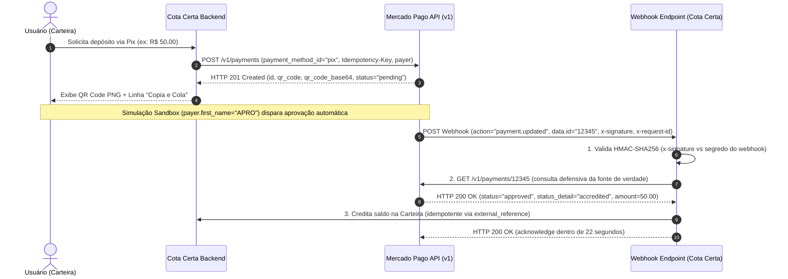

# Contrato de Integração Pix via Mercado Pago (Modo Sandbox)

- **Issue de Origem:** [#2 Investigar contrato de integração do Pix Sandbox via Mercado Pago](https://github.com/ratopythonista/cota-certa/issues/2)
- **Contexto de Domínio:** [CONTEXT.md](../../CONTEXT.md) — Fluxo de depósito para a **Wallet (Carteira)**
- **Data da Pesquisa:** 2026-09-05
- **Status:** Concluído / Pronto para Decisão Arquitetural

---

## 1. Sumário Executivo

Este documento detalha o contrato de integração direta com a API v1 do Mercado Pago para processamento de depósitos instantâneos via **Pix** em ambiente **Sandbox**, sem dependência de SDKs legados (como o pacote `mercadopago-sdk`), utilizando Python moderno com `httpx`.

### Principais Conclusões

1. **Endpoint Unificado:** A API do Mercado Pago utiliza o mesmo endpoint para Sandbox e Produção: `https://api.mercadopago.com/v1/payments`. O chaveamento de ambiente é estritamente determinado pelo prefixo do token de autenticação (`TEST-...` vs `APP_USR-...`). Não existe um subdomínio de sandbox separado para a API REST de pagamentos.
2. **Idempotência Obrigatória:** Toda requisição de criação de pagamento exige o cabeçalho `X-Idempotency-Key` (UUIDv4) para prevenir duplicação de depósitos em cenários de retry de rede.
3. **Payload Pix Dinâmico:** Requisição `POST /v1/payments` contendo `payment_method_id: "pix"`, `transaction_amount`, `description` e objeto `payer` estruturado.
4. **Extração de QR Code:** O retorno (HTTP 201) disponibiliza o payload Pix em `point_of_interaction.transaction_data.qr_code` (código copia-e-cola no padrão EMVCo BR Code) e `point_of_interaction.transaction_data.qr_code_base64` (imagem PNG codificada em Base64 pronta para renderização no frontend).
5. **Autenticação e Validação de Webhooks:**
   - As notificações chegam via `POST` contendo o cabeçalho `x-signature: ts=<timestamp>,v1=<hash>` e `x-request-id`.
   - A assinatura HMAC-SHA256 é calculada sobre o manifesto padronizado: `id:<data.id>;request-id:<x-request-id>;ts:<ts>;`.
   - **Padrão Defensivo de Confirmação:** O webhook atua apenas como gatilho de sinalização assíncrona. O backend **obrigatoriamente** consulta a fonte de verdade na API (`GET /v1/payments/{data.id}`) antes de creditar o saldo na Carteira, verificando se `status == "approved"`.
6. **Simulação de Aprovação em Sandbox:** Como o QR Code Pix em sandbox não pode ser liquidado por aplicativos bancários reais, a simulação automatizada de aprovação é disparada configurando o campo `payer.first_name = "APRO"` na criação ou na ordem de teste.

---

## 2. Fluxo da Arquitetura de Pagamento Pix



---

## 3. Fontes Primárias e Documentação Oficial

Todas as diretrizes deste documento foram validadas diretamente na documentação oficial de desenvolvedores do Mercado Pago:

- **Criar Pagamento (`POST /v1/payments`):**  
  [Mercado Pago Developers - Create Payment Reference](https://www.mercadopago.com.br/developers/en/reference/online-payments/checkout-api-payments/create-payment/post)
- **Consultar Pagamento (`GET /v1/payments/{id}`):**  
  [Mercado Pago Developers - Get Payment Reference](https://www.mercadopago.com.br/developers/en/reference/online-payments/checkout-api-payments/get-payment/get)
- **Integração com Pix via API:**  
  [Mercado Pago Developers - Integrate with Pix](https://www.mercadopago.com.br/developers/pt/docs/checkout-api/integration-configuration/integrate-with-pix)
- **Webhooks e Validação de Assinatura (`x-signature`):**  
  [Mercado Pago Developers - Notifications / Webhooks](https://www.mercadopago.com.br/developers/en/docs/your-integrations/notifications/webhooks)
- **Testes de Integração e Simulação Sandbox Pix:**  
  [Mercado Pago Developers - Integration Test Pix](https://www.mercadopago.com.br/developers/en/docs/checkout-api-orders/integration-test/pix)

---

## 4. Especificação Técnica do Contrato da API

### 4.1. Criação de Pagamento Pix (`POST /v1/payments`)

#### Headers Obrigatórios

| Header | Tipo | Descrição | Exemplo |
| :--- | :--- | :--- | :--- |
| `Authorization` | String | Token Bearer com credencial de teste | `Bearer TEST-1234567890-abcdef...` |
| `X-Idempotency-Key` | String | Chave única UUIDv4 para cada tentativa | `c7f99a09-6bc2-4e44-b0a8-b64ecf39b6b9` |
| `Content-Type` | String | Tipo de conteúdo JSON | `application/json` |

#### Payload de Requisição (JSON)

```json
{
  "transaction_amount": 25.00,
  "description": "Depósito Carteira Cota Certa",
  "payment_method_id": "pix",
  "external_reference": "wallet_dep_usr123_tx987654",
  "notification_url": "https://api.cotacerta.com.br/api/v1/webhooks/mercadopago",
  "date_of_expiration": "2026-09-05T20:30:00.000-03:00",
  "payer": {
    "email": "test_user_789456@testuser.com",
    "first_name": "APRO",
    "last_name": "Comprador",
    "identification": {
      "type": "CPF",
      "number": "19119119100"
    }
  }
}
```

#### Detalhes dos Campos:
- `transaction_amount` *(float, obrigatório)*: Valor monetário em Reais (BRL). Deve ser positivo e conter no máximo 2 casas decimais.
- `payment_method_id` *(string, obrigatório)*: Deve ser rigorosamente `"pix"`.
- `external_reference` *(string, opcional mas recomendado)*: Identificador da transação no domínio Cota Certa (máx. 64 caracteres, caracteres permitidos: alfanuméricos, hífen, underline).
- `date_of_expiration` *(string ISO 8601, opcional)*: Data limite para expiração da cobrança Pix. Se omitido, o Mercado Pago aplica a expiração padrão da conta.
- `payer.first_name` *(string, obrigatório no sandbox)*: O valor `"APRO"` ativa a aprovação automática no simulador de testes.

#### Resposta de Sucesso (`HTTP 201 Created`)

```json
{
  "id": 1314987654,
  "date_created": "2026-09-05T19:30:00.000-04:00",
  "date_approved": null,
  "date_last_updated": "2026-09-05T19:30:00.000-04:00",
  "date_of_expiration": "2026-09-05T20:30:00.000-03:00",
  "operation_type": "regular_payment",
  "payment_method_id": "pix",
  "payment_type_id": "bank_transfer",
  "status": "pending",
  "status_detail": "waiting_transfer",
  "currency_id": "BRL",
  "description": "Depósito Carteira Cota Certa",
  "live_mode": false,
  "external_reference": "wallet_dep_usr123_tx987654",
  "transaction_amount": 25.00,
  "point_of_interaction": {
    "type": "CHECKOUT",
    "sub_type": "DEFAULT",
    "application_data": {
      "name": "cota_certa",
      "version": "1.0.0"
    },
    "transaction_data": {
      "qr_code": "00020101021226830014br.gov.bcb.pix2561qrcodes-pix.mercadopago.com/v2/...",
      "qr_code_base64": "iVBORw0KGgoAAAANSUhEUgAAAPAAAADwCAYAAAA+VemSAAA...",
      "ticket_url": "https://www.mercadopago.com.br/payments/1314987654/ticket?caller_id=...",
      "bank_info": {
        "collector": {
          "account_holder_name": "COTACERTA"
        }
      }
    }
  }
}
```

#### Parsing dos Dados de Apresentação:
- `point_of_interaction.transaction_data.qr_code`: String textual do payload Pix padrão Banco Central (EMVCo). Utilizada para a funcionalidade "Pix Copia e Cola".
- `point_of_interaction.transaction_data.qr_code_base64`: Imagem PNG em formato Base64. Pode ser injetada diretamente em tags de imagem HTML (``).
- `point_of_interaction.transaction_data.ticket_url`: Página externa do Mercado Pago com instruções de pagamento (fallback para visualização).

---

### 4.2. Notificações Webhook e Segurança

#### Estrutura do Payload Recebido

O Mercado Pago envia requisições HTTP `POST` para a URL configurada:

```json
{
  "id": 12345678,
  "live_mode": false,
  "type": "payment",
  "date_created": "2026-09-05T19:35:12.123-04:00",
  "user_id": 99887766,
  "api_version": "v1",
  "action": "payment.updated",
  "data": {
    "id": "1314987654"
  }
}
```

#### Headers de Segurança Recebidos:
- `x-signature`: String contendo `ts=<timestamp_ms>,v1=<hash_hexadecimal>`.
- `x-request-id`: UUID único da requisição de webhook gerado pelo gateway.

#### Algoritmo de Validação da Assinatura HMAC:
1. Extrair os valores `ts` e `v1` separando os fragmentos delimitados por vírgula em `x-signature`.
2. Montar a string de manifesto exata:
   ```
   id:[data.id];request-id:[x-request-id];ts:[ts];
   ```
   *Regras:*
   - Se o campo `data.id` contiver letras, deve ser convertido para **minúsculas** (`data.id.lower()`).
   - Se algum campo (`id` ou `request-id`) não estiver presente, a respectiva chave-valor deve ser omitida da string do manifesto antes da computação.
3. Computar o hash **HMAC-SHA256** do manifesto usando a chave secreta de webhook configurada no painel de integrações (`WEBHOOK_SECRET`).
4. Comparar a chave gerada com o `v1` utilizando comparação em tempo constante (`hmac.compare_digest`) para mitigar ataques de temporização (timing attacks).
5. (Opcional, recomendado) Comparar `ts` com o timestamp atual para descartar notificações com atraso excessivo (replay attacks).

---

### 4.3. Consulta Defensiva da Fonte de Verdade (`GET /v1/payments/{id}`)

Nunca credite saldo na carteira baseado unicamente nos dados transitados no webhook. Após a validação da assinatura:

1. Chamar `GET https://api.mercadopago.com/v1/payments/{data.id}` com o `Authorization: Bearer <TEST_ACCESS_TOKEN>`.
2. Verificar os campos:
   - `status == "approved"`
   - `status_detail == "accredited"`
   - `transaction_amount == <valor_esperado_da_ordem>`
   - `external_reference == <identificador_interno_da_ordem>`
3. Atualizar a Carteira e responder à requisição do webhook com `HTTP 200` em até **22 segundos** para prevenir reenvios automáticos.

---

## 5. Implementação Completa em Python com `httpx`

O código a seguir é auto-contido, utiliza `httpx` assíncrono e síncrono, valida tipagem e não requer nenhuma biblioteca proprietária.

```python
"""
Cliente de Integração Mercado Pago Pix (Sandbox e Produção)
Sem dependência de SDK legado, baseado em httpx e hmac nativo.
"""

from __future__ import annotations

import hashlib
import hmac
import uuid
from dataclasses import dataclass
from datetime import datetime, timezone
from typing import Any, Optional

import httpx


@dataclass(frozen=True)
class PixPayer:
    email: str
    first_name: str
    last_name: str
    cpf: str


@dataclass(frozen=True)
class PixPaymentResult:
    payment_id: int
    status: str
    status_detail: str
    transaction_amount: float
    external_reference: Optional[str]
    qr_code: str  # EMVCo Copia e Cola
    qr_code_base64: str  # Imagem PNG base64
    ticket_url: Optional[str]
    date_of_expiration: Optional[str]


class MercadoPagoPixClient:
    """Cliente HTTP para emissão e consulta de pagamentos Pix via Mercado Pago API v1."""

    BASE_URL = "https://api.mercadopago.com"

    def __init__(self, access_token: str, webhook_secret: Optional[str] = None):
        """
        :param access_token: Token de acesso (TEST-... para sandbox, APP_USR-... para produção)
        :param webhook_secret: Chave secreta de validação do webhook obtida no painel
        """
        self._access_token = access_token
        self._webhook_secret = webhook_secret

    def _default_headers(self, idempotency_key: Optional[str] = None) -> dict[str, str]:
        headers = {
            "Authorization": f"Bearer {self._access_token}",
            "Content-Type": "application/json",
            "Accept": "application/json",
        }
        if idempotency_key:
            headers["X-Idempotency-Key"] = idempotency_key
        return headers

    def create_pix_payment(
        self,
        amount: float,
        description: str,
        payer: PixPayer,
        external_reference: Optional[str] = None,
        notification_url: Optional[str] = None,
        date_of_expiration: Optional[datetime] = None,
        idempotency_key: Optional[str] = None,
        timeout: float = 15.0,
    ) -> PixPaymentResult:
        """
        Cria um pagamento dinâmico Pix via POST /v1/payments.
        """
        if idempotency_key is None:
            idempotency_key = str(uuid.uuid4())

        payload: dict[str, Any] = {
            "transaction_amount": round(amount, 2),
            "description": description,
            "payment_method_id": "pix",
            "payer": {
                "email": payer.email,
                "first_name": payer.first_name,
                "last_name": payer.last_name,
                "identification": {
                    "type": "CPF",
                    "number": "".join(filter(str.isdigit, payer.cpf)),
                },
            },
        }

        if external_reference:
            payload["external_reference"] = external_reference
        if notification_url:
            payload["notification_url"] = notification_url
        if date_of_expiration:
            payload["date_of_expiration"] = date_of_expiration.isoformat()

        endpoint = f"{self.BASE_URL}/v1/payments"
        headers = self._default_headers(idempotency_key=idempotency_key)

        with httpx.Client(timeout=timeout) as client:
            response = client.post(endpoint, headers=headers, json=payload)

        if response.status_code != 201:
            raise RuntimeError(
                f"Falha ao criar Pix no Mercado Pago ({response.status_code}): {response.text}"
            )

        data = response.json()
        poi = data.get("point_of_interaction", {})
        tx_data = poi.get("transaction_data", {})

        return PixPaymentResult(
            payment_id=data["id"],
            status=data["status"],
            status_detail=data["status_detail"],
            transaction_amount=float(data["transaction_amount"]),
            external_reference=data.get("external_reference"),
            qr_code=tx_data.get("qr_code", ""),
            qr_code_base64=tx_data.get("qr_code_base64", ""),
            ticket_url=tx_data.get("ticket_url"),
            date_of_expiration=data.get("date_of_expiration"),
        )

    def get_payment(self, payment_id: int | str, timeout: float = 10.0) -> dict[str, Any]:
        """
        Consulta o status consolidado de um pagamento via GET /v1/payments/{payment_id}.
        """
        endpoint = f"{self.BASE_URL}/v1/payments/{payment_id}"
        headers = self._default_headers()

        with httpx.Client(timeout=timeout) as client:
            response = client.get(endpoint, headers=headers)

        if response.status_code != 200:
            raise RuntimeError(
                f"Falha ao consultar pagamento {payment_id} ({response.status_code}): {response.text}"
            )

        return response.json()

    def verify_webhook_signature(
        self,
        x_signature_header: str,
        x_request_id_header: Optional[str],
        data_id: str,
    ) -> bool:
        """
        Valida a assinatura HMAC-SHA256 recebida no cabeçalho x-signature.
        """
        if not self._webhook_secret:
            raise ValueError("webhook_secret não configurado no cliente.")

        # 1. Separar ts e v1
        sig_parts: dict[str, str] = {}
        for part in x_signature_header.split(","):
            if "=" in part:
                k, v = part.strip().split("=", 1)
                sig_parts[k.strip()] = v.strip()

        ts = sig_parts.get("ts")
        v1 = sig_parts.get("v1")
        if not ts or not v1:
            return False

        # 2. Montar a string de manifesto no padrão oficial Mercado Pago:
        # id:[data.id_url];request-id:[x-request-id_header];ts:[ts_header];
        manifest_parts = []
        if data_id:
            manifest_parts.append(f"id:{str(data_id).lower()};")
        if x_request_id_header:
            manifest_parts.append(f"request-id:{x_request_id_header};")
        manifest_parts.append(f"ts:{ts};")

        manifest = "".join(manifest_parts)

        # 3. Calcular o HMAC-SHA256
        computed_signature = hmac.new(
            self._webhook_secret.encode("utf-8"),
            manifest.encode("utf-8"),
            hashlib.sha256,
        ).hexdigest()

        # 4. Comparar em tempo constante
        return hmac.compare_digest(computed_signature, v1)


# =====================================================================
# Exemplo de Handler de Webhook para FastAPI / Dash / Flask
# =====================================================================
def handle_mercadopago_webhook_event(
    client: MercadoPagoPixClient,
    payload: dict[str, Any],
    headers: dict[str, str],
) -> dict[str, Any]:
    """
    Executa a verificação completa de webhook:
    1. Valida a assinatura de autenticidade (se cabeçalho presente)
    2. Identifica se o evento é do tipo "payment"
    3. Consulta a API oficial (GET /v1/payments/{id})
    4. Retorna dados do pagamento aprovado para crédito na Wallet
    """
    topic = payload.get("type") or payload.get("topic")
    if topic != "payment":
        # Ignora eventos que não sejam de pagamento
        return {"status": "ignored", "reason": f"topic {topic} not handled"}

    data = payload.get("data", {})
    payment_id = data.get("id")
    if not payment_id:
        raise ValueError("Payload de webhook sem data.id válido.")

    # Validação da Assinatura HMAC (se configurada)
    x_sig = headers.get("x-signature")
    x_req_id = headers.get("x-request-id")
    if x_sig and client._webhook_secret:
        valid = client.verify_webhook_signature(
            x_signature_header=x_sig,
            x_request_id_header=x_req_id,
            data_id=str(payment_id),
        )
        if not valid:
            raise PermissionError("Assinatura do webhook inválida (HMAC mismatch).")

    # Consulta Defensiva à Fonte de Verdade
    payment_info = client.get_payment(payment_id)
    current_status = payment_info.get("status")
    status_detail = payment_info.get("status_detail")
    external_ref = payment_info.get("external_reference")
    amount = float(payment_info.get("transaction_amount", 0.0))

    if current_status == "approved" and status_detail == "accredited":
        return {
            "status": "approved",
            "payment_id": payment_id,
            "external_reference": external_ref,
            "amount": amount,
            "accredited": True,
        }

    return {
        "status": current_status,
        "payment_id": payment_id,
        "external_reference": external_ref,
        "amount": amount,
        "accredited": False,
    }
```

---

## 6. Guia Passo a Passo de Testes no Sandbox

Para testar o fluxo completo localmente com as credenciais de teste:

1. **Obter Credenciais:**
   - Acesse o portal de desenvolvedores do Mercado Pago.
   - Navegue até **Suas Integrações > Criar Aplicação (ou selecione existente) > Credenciais de Teste**.
   - Copie o **Access Token** (`TEST-...`) e a chave secreta em **Webhooks > Configurar Notificações**.
2. **Criar Pagamento de Teste com Aprovação Automática:**
   - Ao emitir o pagamento no ambiente sandbox, envie `payer.first_name = "APRO"`.
   - Isso instrui a API interna a transicionar o status do pagamento para `approved` automaticamente após a emissão.
3. **Simular Recebimento de Webhook Localmente:**
   - Utilize uma ferramenta como `ngrok` ou `localtunnel` para expor o webhook local (`https://<ngrok-id>.ngrok.io/webhooks/mercadopago`).
   - Configure a URL de teste nas configurações de Webhook do Mercado Pago ou informe-a diretamente no campo `notification_url` do payload de criação do pagamento.
4. **Verificação de Idempotência:**
   - Se a requisição de criação falhar por timeout de rede, repita a chamada enviando o mesmo `X-Idempotency-Key`. O Mercado Pago retornará o mesmo `id` e QR Code gerados anteriormente sem criar uma nova cobrança duplicada.

---

## 7. Recomendações para a Camada de Domínio do Cota Certa

De acordo com o modelo de domínio definido em `CONTEXT.md`:

1. **Entidade Wallet (Carteira):**
   - O depósito Pix deve ser registrado no banco de dados com estado inicial `PENDING`, armazenando o `payment_id` do Mercado Pago e o `wallet_tx_id` (que é enviado como `external_reference`).
2. **Idempotência no Crédito de Saldo:**
   - O processamento da aprovação no webhook deve ser transacional e protegido por restrição de unicidade no `payment_id` ou verificação de estado do depósito (se já `COMPLETED`, retornar HTTP 200 sem re-creditar saldo).
3. **Segurança de Webhooks:**
   - Nunca expor o endpoint de webhook sem validação de HMAC em produção.
   - Sempre consultar a API oficial via `GET /v1/payments/{id}` como dupla checagem contra payloads forjados.
4. **Apresentação no Dash:**
   - A interface do usuário pode renderizar o QR Code imediatamente decodificando o `qr_code_base64` e disponibilizar um botão para copiar a string `qr_code` para a área de transferência.
